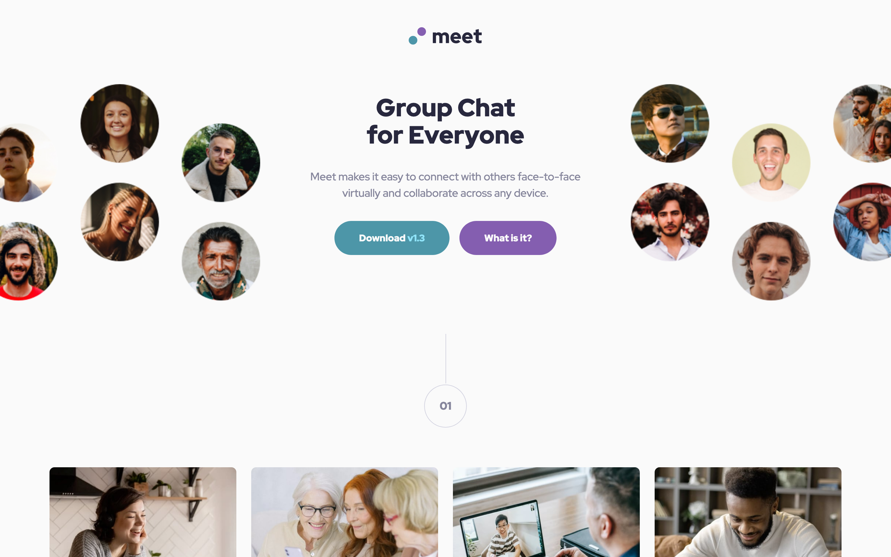

# Frontend Mentor - Meet landing page solution

This is a solution to the [Meet landing page challenge on Frontend Mentor](https://www.frontendmentor.io/challenges/meet-landing-page-rbTDS6OUR). Frontend Mentor challenges help you improve your coding skills by building realistic projects.

## Table of contents

- [Frontend Mentor - Meet landing page solution](#frontend-mentor---meet-landing-page-solution)
  - [Table of contents](#table-of-contents)
  - [Overview](#overview)
    - [The challenge](#the-challenge)
    - [Screenshot](#screenshot)
    - [Demo Videos](#demo-videos)
    - [Links](#links)
  - [My process](#my-process)
    - [Built with](#built-with)
    - [What I learned](#what-i-learned)
    - [Continued development](#continued-development)
    - [Useful resources](#useful-resources)
  - [Author](#author)

## Overview

### The challenge

Users should be able to:

- View the optimal layout depending on their device's screen size
- See hover states for interactive elements

### Screenshot



### Demo Videos

To visit the site and play around with viewports yourself, please see the solution URL in the "Links" section of this README. Here is a demo video if you don't want to visit the site. It is for the mobile solution.

**Mobile solution demo video**
https://github.com/user-attachments/assets/15f5f868-db84-41c0-a169-8251547e4242

### Links

- Solution URL: [GitHub Pages](https://kmulqueen.github.io/meet-landing-page-challenge/)

## My process

### Built with

- Semantic HTML5 markup
- CSS custom properties
- Flexbox
- CSS Grid
- Mobile-first workflow

### What I learned

Working on this project taught me several valuable CSS and responsive design techniques:

- **Overlay Text on Images**: I learned multiple approaches for placing text over images while maintaining accessibility, including CSS Grid with z-index, and using pseudo-elements with background colors.

- **Image Positioning in Grid Layouts**: I discovered how to position images that extend beyond their containers using techniques like:

  ```css
  .hero__container img {
    width: 115%;
    max-width: 115%;
    justify-self: end; /* or start */
  }
  ```

- **Responsive Images with srcset**: I implemented the srcset attribute for responsive image loading based on viewport size:

  ```html
  
  ```

- **Cross-Browser Compatibility**: I learned about browser-specific overflow properties and how to implement them alongside standard properties:
  ```css
  .hero {
    overflow: hidden; /* Standard property */
    overflow: -moz-hidden-unscrollable; /* Firefox-specific */
  }
  ```

### Continued development

Areas I want to focus on in future projects:

1. **Advanced CSS Grid Techniques**: I'd like to deepen my understanding of how to create more complex grid layouts and position elements precisely within them.

2. **Browser Testing**: I need to develop a more systematic approach to testing across different browsers to catch compatibility issues earlier.

3. **Accessibility Best Practices**: I want to ensure my approach to overlaying text on images maintains good accessibility standards.

4. **Image Optimization**: Further exploring responsive image techniques including the sizes attribute to optimize loading times.

### Useful resources

- [MDN Web Docs: CSS Grid Layout](https://developer.mozilla.org/en-US/docs/Web/CSS/CSS_Grid_Layout) - This resource helped me understand grid positioning and how to control image placement within grid areas.

- [MDN Web Docs: The Responsive Images](https://developer.mozilla.org/en-US/docs/Learn/HTML/Multimedia_and_embedding/Responsive_images) - This article helped me implement srcset correctly and understand how to verify the correct images are loading at different breakpoints.

- [CSS-Tricks: A Complete Guide to CSS Media Queries](https://css-tricks.com/a-complete-guide-to-css-media-queries/) - Excellent resource for implementing responsive designs across different device sizes.

- [Web.dev: CSS Overflow](https://web.dev/learn/css/overflow/) - Helped me understand different overflow handling techniques and cross-browser compatibility issues.

## Author

- Website - [Kyle Mulqueen](https://kmulqueen.github.io/portfolio-2025/)
- Frontend Mentor - [@kmulqueen](https://www.frontendmentor.io/profile/kmulqueen)
